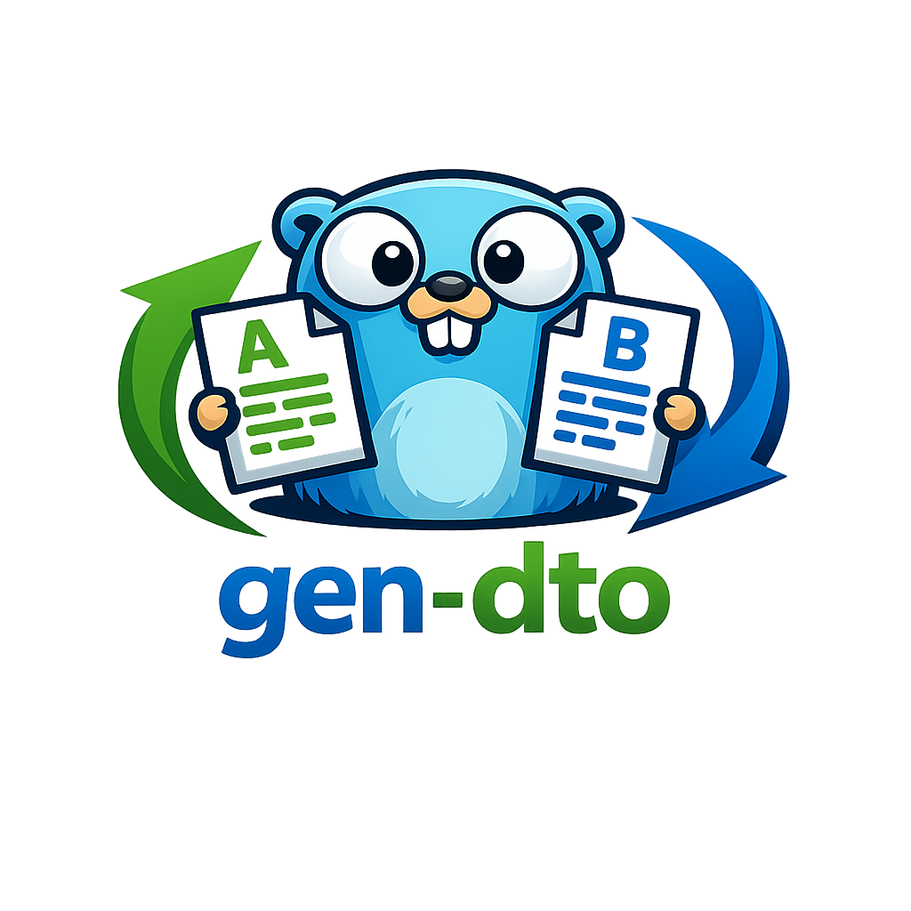

# gen-dto

<p align="center">
  
</p>

<p align="center">
  Generate bidirectional DTO converters for Go structs.
</p>

<p align="center">
  <a href="https://github.com/seitarof/gen-dto/actions/workflows/ci.yml"></a>
  <a href="LICENSE"></a>
  
</p>

`gen-dto` is a CLI tool that generates conversion code between Go structs using `go:generate`.

## Highlights

- Generates both directions in one file (`A -> B` and `B -> A`)
- Case-insensitive field matching
- Supports type aliases (`type X = otherpkg.Y`)
- Recursively handles nested structs (including same-module cross-package types)
- Leaves unsupported fields as TODO comments without blocking other conversions

## Installation

### go install

```bash
go install github.com/seitarof/gen-dto/cmd/gen-dto@latest
```

### Homebrew

```bash
brew tap seitarof/homebrew-tap
brew install gen-dto
```

## Quick Start

```go
//go:generate gen-dto \
//  --src-type=User \
//  --src-path=./internal/domain/model \
//  --dst-type=UserResponse \
//  --dst-path=./internal/dto \
//  --filename=user_conv_gen.go \
//  --ignore-fields=Password,SecretKey
```

```bash
go generate ./...
```

## CLI

Required flags:

- `--src-type`, `-s`
- `--src-path`
- `--dst-type`, `-d`
- `--dst-path`
- `--filename`, `-o`

Optional flags:

- `--ignore-fields`
- `--func-name` (forward root conversion name)
- `--version`, `-v`

## Supported Go Version

- Go `1.26.x`

## Documentation

- Contributor guide: [CONTRIBUTING.md](CONTRIBUTING.md)

## License

MIT License. See [LICENSE](LICENSE).
